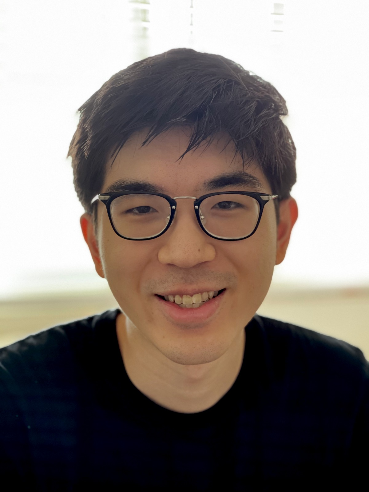

<strong>Kwan Ho Ryan Chan</strong>

<i>I go by Ryan. (He, Him, His)</i>

<strong>Email</strong>: ryanchankh (at) berkeley (dot) edu  

<a href="https://www.linkedin.com/in/ryanchankh">linkedin</a> | 
<a href="https://www.github.com/ryanchankh">github</a> | 
<a href="https://scholar.google.com/citations?user=DBXWBqcAAAAJ&hl=en">gscholar</a> | 
<a href="./files/cv.pdf">cv</a> 

 

<!--[linkedin](https://www.linkedin.com/in/ryanchankh) | 
[github](https://www.github.com/ryanchankh) | 
[gscholar](https://scholar.google.com/citations?user=DBXWBqcAAAAJ&hl=en) |
[cv](./files/cv.pdf)-->

### Bio
<!--**Bio**:  -->
I am a first-year PhD student at John Hopkins University, currently supervised by Prof. René Vidal (JHU) and Prof. Yi Ma (UC Berkeley). I am also a NSF Graduate Research Fellow. In 2019, I received my BA in Applied Mathematics from University of California, Berkeley. During my undergraduate studies, I was a research assistant at Prof. Yi Ma's group. I was also a machine learning researcher trainee at Lawrence Livermore National Lab. 

<!--**Research Interests**:  -->
### Research Interests
I am interested in the theory and practice of Deep Learning, especially 1). To bring mathematical interpretability to deep learning by incorporating principles from low-dimensional methods such as compressive sensing and new emerging fields such as high-dimensional statistics; and 2). To develop explainable and practical algorithms for real-life applications by improving our understanding of structures in data from research domains such as neuroscience and computer vision.

<!--**Publications:**-->
### Publications
***Conferences and Workshops***  

- **[NeurIPS'20]** Yaodong Yu\*, <u>Kwan Ho Ryan Chan</u>\*, Chong You, Chaobing Song, and Yi Ma. *Learning Diverse and Discriminative Representations via the Principle of Maximal Coding Rate Reduction*. Neural Information Processing Systems, 2020.
([paper](https://proceedings.neurips.cc/paper/2020/file/6ad4174eba19ecb5fed17411a34ff5e6-Supplemental.pdf))
([code](https://github.com/ryanchankh/mcr2))  
- **[NICE'20]** Dylan M. Paiton, Steven Shepard, <u>Kwan Ho Ryan Chan</u>, and Bruno A. Olshausen. *Subspace Locally Competitive Algorithms*.  Proceedings of the Neuro-Inspired Computational Elements Workshop, 2020. 
([paper](https://dl.acm.org/doi/abs/10.1145/3381755.3381765))
([code](https://github.com/dpaiton/DeepSparseCoding/tree/lca_subspace))
 
***Preprints***  

- <u>Kwan Ho Ryan Chan</u>\*, Yaodong Yu\*, Chong You\*, Haozhi Qi, John Wright, Yi Ma. *Deep Networks from the Principle of Rate Reduction*. 2020.
([paper](https://arxiv.org/abs/2010.14765)) ([code](https://github.com/ryanchankh/redunet))
- Sam Nguyen\*, <u>Kwan Ho Ryan Chan</u>\*, Braden Soper, Jose Cadena, Paul Kiszka, Lucas Womack, Mark Work, Joan M. Muggan, Steven T. Haller, Jennifer Hanrahan, David J. Kennedy, Deepa Mukundan, Priyadip Ray. *Early Prediction of Advserse Outcomes for COVID-19 Patients under Cost Constraints*. 2021.
- Braden Soper\*, Jose Cadena\*, Sam Nguyen, <u>Kwan Ho Ryan Chan</u>, Paul Kiszka, Lucas Womack, Mark Work, Joan M. Muggan, Steven T. Haller, Jennifer Hanrahan, David J. Kennedy, Deepa Mukundan, Priyadip Ray. *Dynamics Stratification of Disease Severity and Prognosis of Hospitalized COVID-19 Patients using Hidden Markov Models*. 2021.

### Fun facts and others
- Feel free to email on research and professional advice, or ask me about how I survived undergrad, etc.  
- My hobbies are playing piano, reading math books and playing video games (yes I have fun).  
- I am from Hong Kong, and I speak fluent Cantonese and Mandarin. More specifically, I think about math in English, but I order Chinese food in Canto or Mandarin, depending on the situation. I won't tell you my Chinese name, but it has 3 characters; one has a part means gold, another has a part means water. 
- I want to take the opporuntiy to thank my family for the support they have given me. 

Last Updated this website: 8 May 2021

